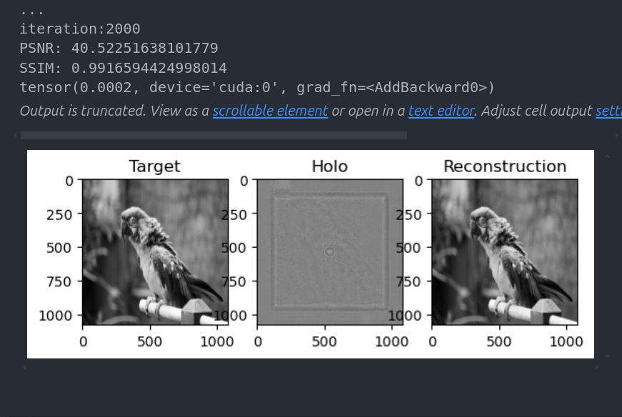
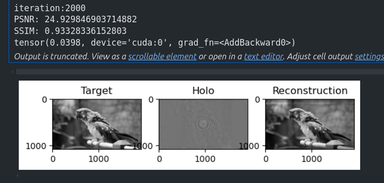
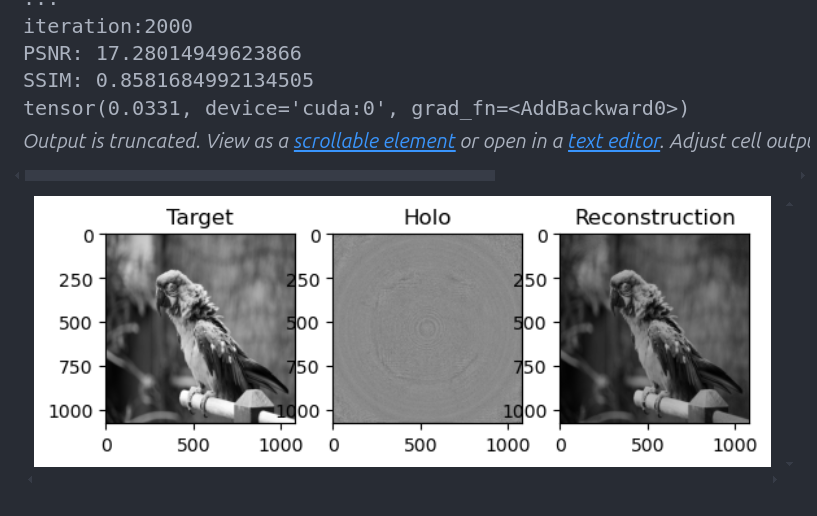
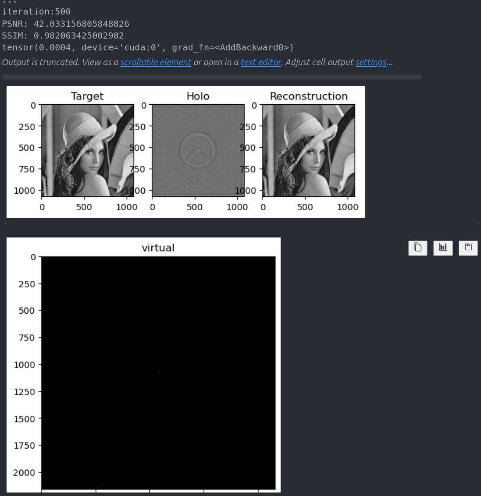
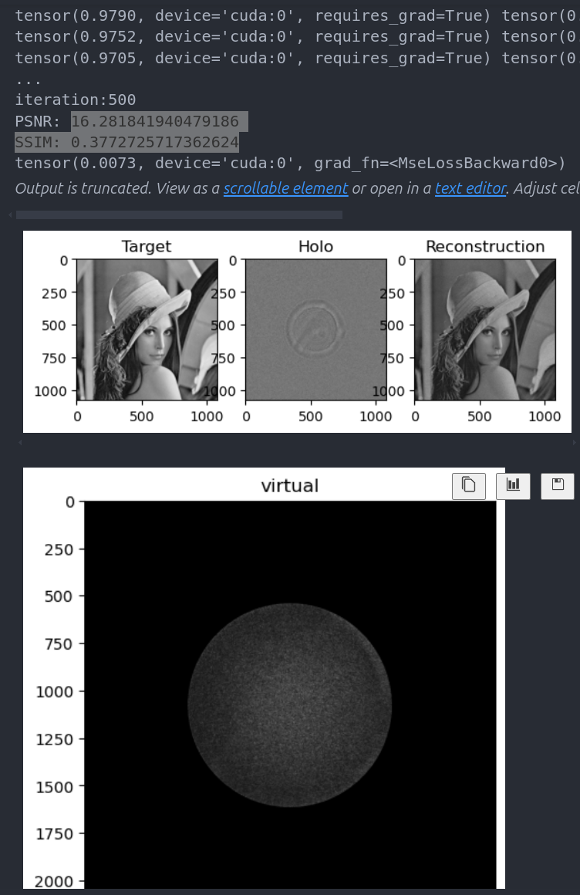
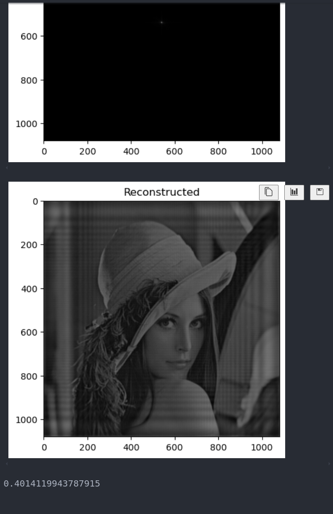

# 基于Sgd的优化Arss_Fresnel 和 Sfft 衍射的重建质量

> *author：nillin*

> *date：2024.10.10*

    说明：这是基于周杰的一个成像质量优化

目前遇到的问题：

1. 没搞清楚整个衍射流程到底该怎么逆向
2. 没有弄清楚arss的采样间隔的问题（已解决）

接下来的阶段性任务

1. 准备将整个衍射过程跑通，目前已经解决了整个衍射过程的s的问题，即sfft的固定s叠加上arss的可变s，目前的问题是sfft放在哪的问题，预计应该是在arss之后
2. 增加虚拟平面的滤波器，验证效果
3. 多跑几张对比图

#### *2024-10-11 00:34:20 update by nillin*

目前已经明确

```
def phase_generation(u_in, feature_size, wavelength, prop_dist, dtype=torch.complex64):
    """
    Propagate the input field u_in through the transfer function TF using FFT.
    """
    field_resolution = u_in.size()
    num_y, num_x = field_resolution[2], field_resolution[3]
    dy, dx = feature_size

    s = 1/3

    m = np.arange(-num_y / 2, num_y / 2)
    n = np.arange(-num_x / 2, num_x / 2)

    y = m * dy
    x = n * dx

    X, Y = np.meshgrid(x, y)

    # phaseh
    phaseh = np.exp(1j * np.pi / (wavelength * prop_dist) * s * ((X/3) ** 2 + (Y/3) ** 2))
    phaseh = phaseh.reshape(1, 1, phaseh.shape[0], phaseh.shape[1])
    phaseh = torch.tensor(phaseh, dtype=dtype).to(u_in.device)

    # phaseu
    phaseu = np.exp(1j * np.pi / (wavelength * prop_dist) * (s ** 2 - s) * ((X/3) ** 2 + (Y/3) ** 2))
    phaseu = phaseu.reshape(1, 1, phaseu.shape[0], phaseu.shape[1])
    phaseu = torch.tensor(phaseu, dtype=dtype).to(u_in.device)

    # phasec
    # phasec = np.exp(1j * wavelength * prop_dist + 1j * np.pi / (wavelength * prop_dist) * (1 - s) * (X ** 2 + Y ** 2)) / (1j * wavelength * prop_dist)
    phasec = np.exp(1j * wavelength * prop_dist + 1j * np.pi / (wavelength * prop_dist) * (1 - s) * (X ** 2 + Y ** 2)) / (1j)
    phasec = phasec.reshape(1, 1, phasec.shape[0], phasec.shape[1])
    phasec = torch.tensor(phasec, dtype=dtype).to(u_in.device)

    return phaseh, phaseu, phasec
```

这一段中欧给你的dx是指的最后重建平面的采样间隔，代码中是3*8um;sdx指代的是原平面的采样间隔，这里是slm，即8um

所以可见，这是一个从slm到image的重建过程的相位函数生成，所以我认为i我应该在arss之前先进行一个i-sfft来把slm衍射到虚拟平面上，虚拟平面的采样率dv由采样定律决定，后续arss的feature_size 由dv\*arss_s决定，prop_dist由s\*dv/8um（这个也是totals） 和 z1决定

### *2024-10-12 16:47:54 update by nillin*



如图所示，我的结果（上）好了不少，但不知道原理，很奇怪
这周先这样下周一在讨论细节

### *2024-10-13 update by nillin*

#### *17:17:06 update*


    如图所示，我给那个trans相位加上了一个圆形孔洞，但是效果不如不加，有点不解

### *2024-10-14 update by nillin*

#### *03:57:01 update*





从上倒下依次是约束复振幅，约束振幅，两次衍射，可以明显看到我们方法的优势所在
